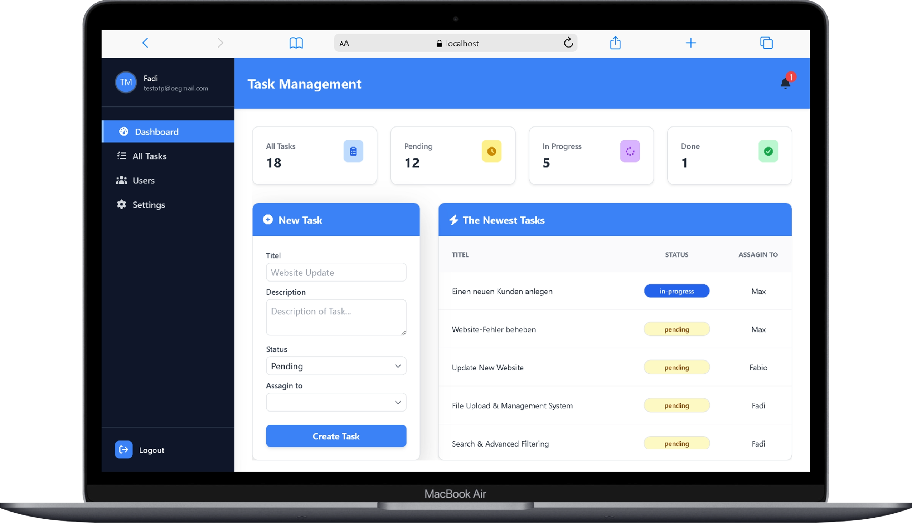
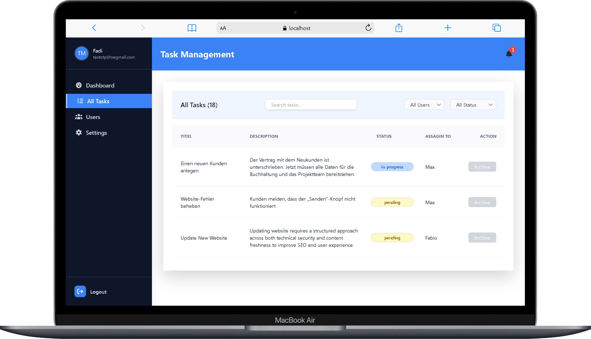
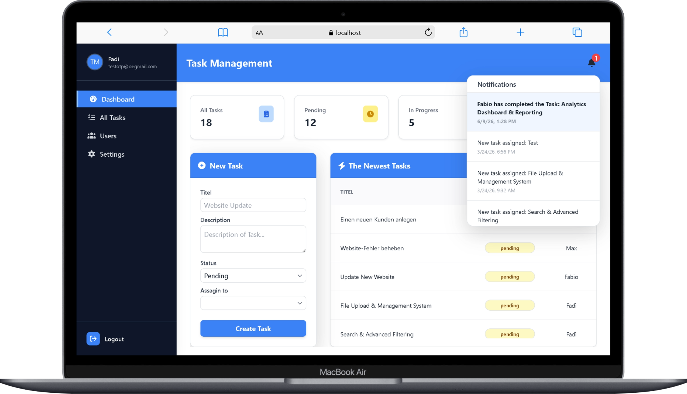
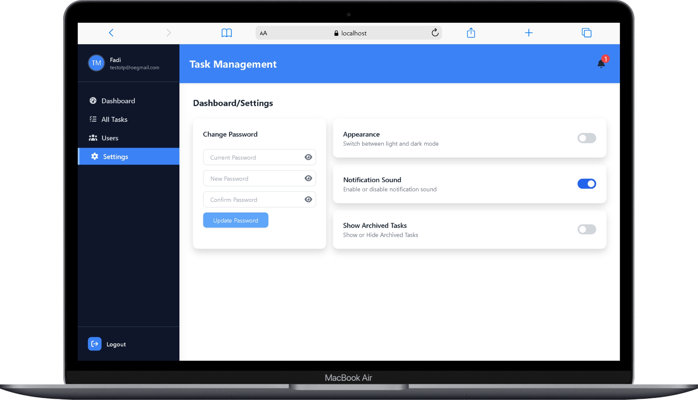
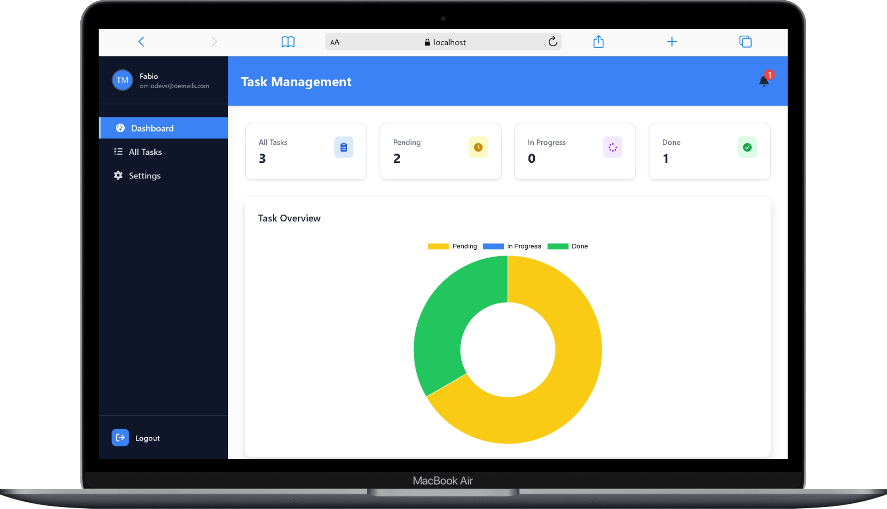
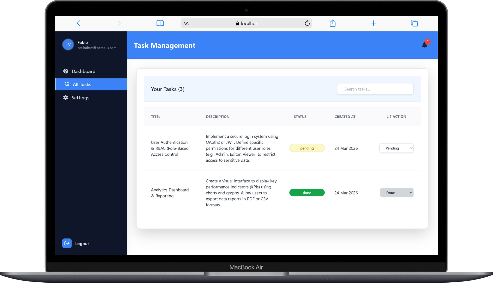
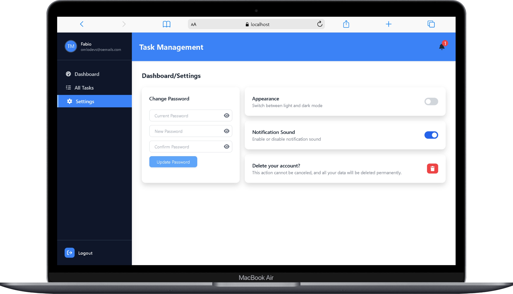
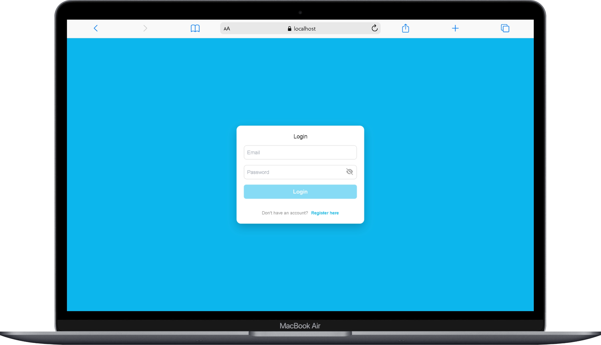
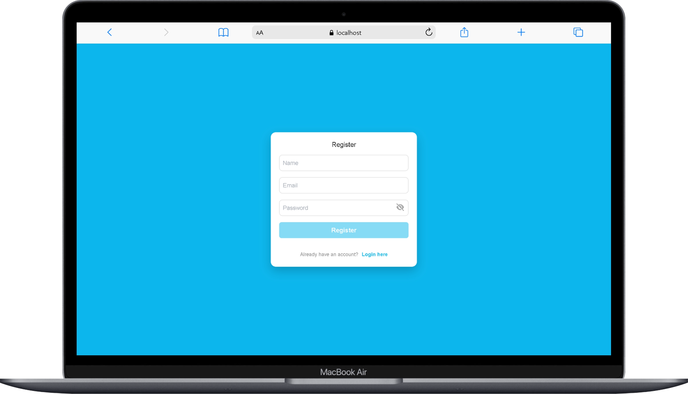
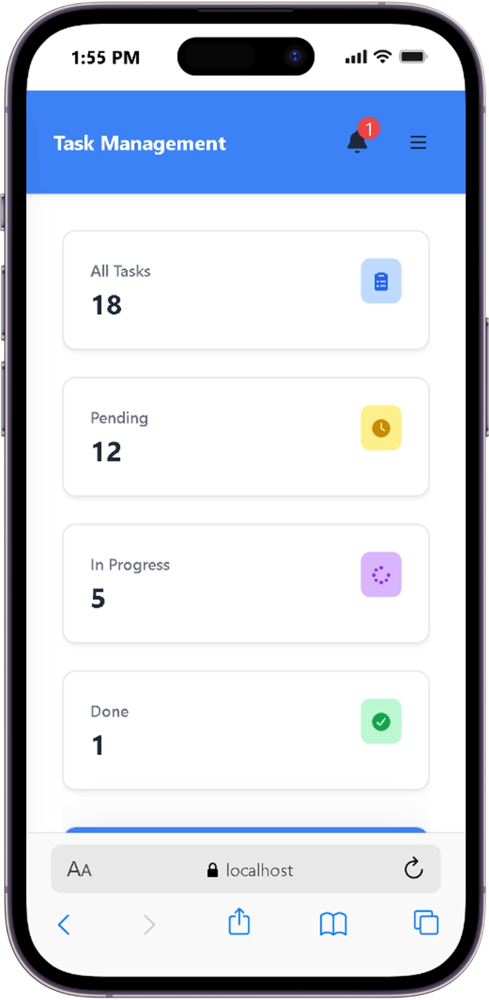

# Task Management System (MEAN Stack) 🚀

A full-stack task management application built with Node.js, Angular, MongoDB, and Socket.IO.  
The app includes authentication, OTP verification, task management, role-based access, and real-time notifications.


---

## 🧠 Features

* User authentication (JWT)
* Account verification via OTP
* Task creation and management
* Real-time notifications (Socket.IO)
* Admin dashboard and user dashboard
* Task filtering by user and by task status
* Settings section
* Responsive design
* Role-based access
* Dockerized setup

---

## 🏗️ Project Structure

```bash
MEAN-Project/
├── backend/
├── frontend/
├── screenshots/
├── docker-compose.yml
```

---

## ⚙️ Tech Stack

### Backend

* Node.js
* Express
* MongoDB
* Socket.IO

### Frontend

* Angular
* Tailwind CSS

### DevOps

* Docker
* Docker Compose

---

## 🚀 Getting Started

### 1. Clone the repository

```bash
git clone https://github.com/DeveloperMaher/MEAN-Project.git
cd MEAN-Project
```

---

### 2. Setup environment variables

Create `.env` inside `backend/`:

```env
PORT=3000
MONGO_URI=your_mongodb_uri
JWT_SECRET=your_secret
REDIS_URL=redis://localhost:6379
```

---

### 3. Run with Docker

```bash
docker-compose up --build
```

---

### 4. Run manually

#### Backend

```bash
cd backend
npm install
npm run dev
```

#### Frontend

```bash
cd frontend
npm install
ng serve
```

---

## 🔌 API Modules

* Auth
* Users
* Tasks
* Notifications

---

## 🔔 Real-time Features

* Live notifications
* Socket-based updates

---

## 📸 Screenshots

### Dashboard Admin





### Dashboard User




### Login & Register 



### Responsive Design 


---

## 👨‍💻 Author

Developer Maher
